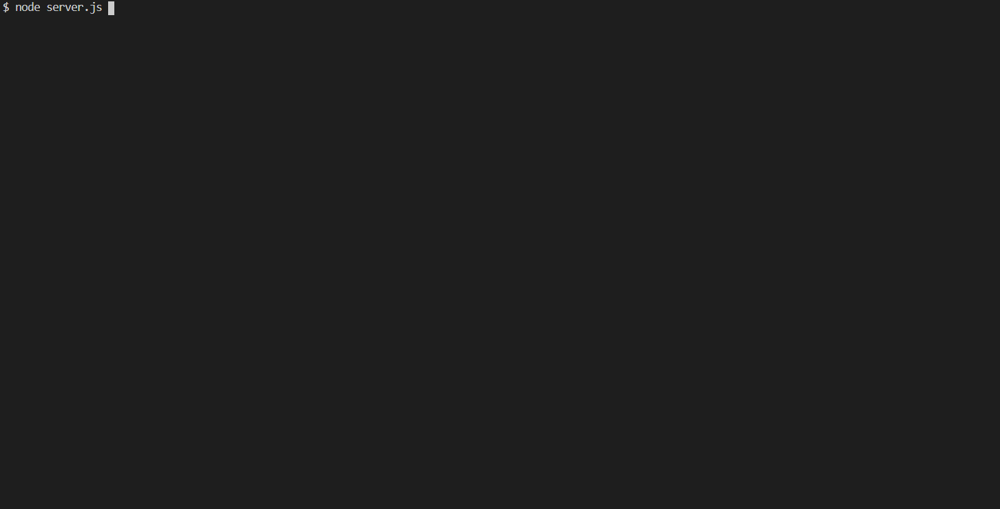
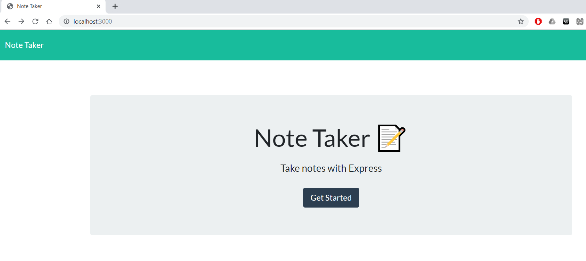
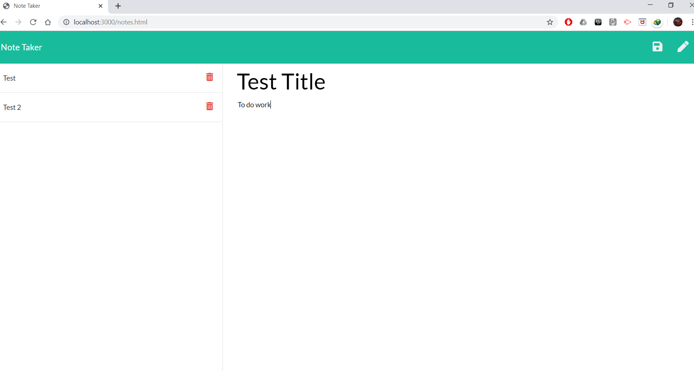
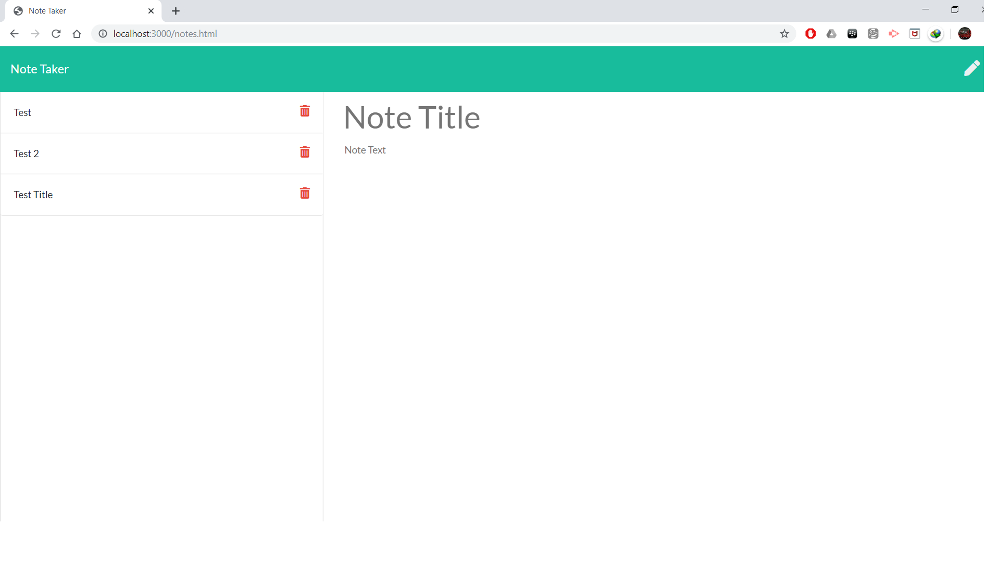
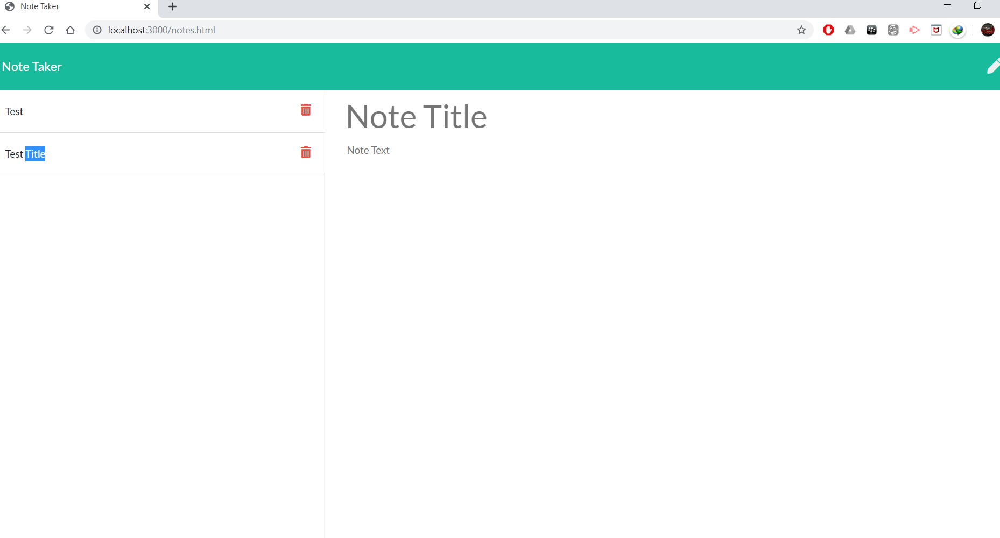

# NoteTaker
This is a note taking app which is able to write ,save & delete note.

## Installation
Git clone the repo on your local computer and run server.js in Git bash shell or use link below

https://evening-spire-86768.herokuapp.com/

## Usage 

Do NPM Install & press enter

Do npm install express & press enter

Do npm install nodemon & press Enter

write node server.js  & press enter

write localhost:3000 on your local browser press enter & click on get started

Write note title & description and press save floppy button to save it 

Saved 

Press Red Trash Can button to delete note

Deleted

